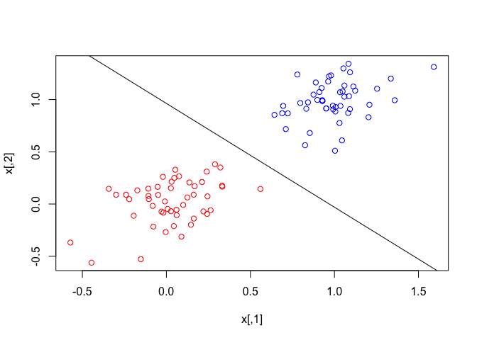
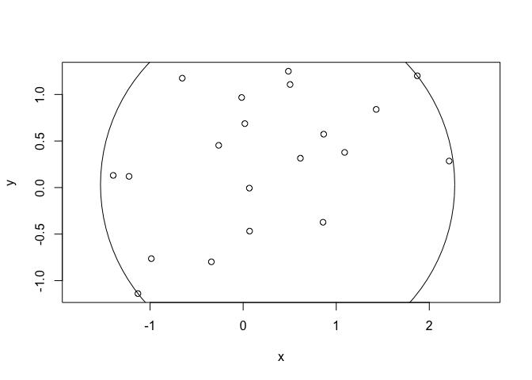

The aim of package `convexjlr` is to provide optimization results
rapidly and reliably in `R` once you formulate your problem as a convex
problem. Having this in mind, we write this vignette in a
problem-oriented style. The vignette will walk you through several
examples using package `convexjlr`:

-   Lasso;
-   Logistic regression;
-   Support Vector Machine (SVM);
-   Smallest circle covering multiple points.

Although these problems already have mature solutions, the purpose here
is to show the wide application of convex optimization and how you can
use `convexjlr` to deal with them easily and extendably.

Some of the examples here are of statistics nature (like Lasso and
logistic regression), and some of the examples here are of
machine-learning nature (like SVM), they may be appealing to readers
with certain backgrounds. If you don't know either of this, don't be
afraid, the smallest circle problem requires no certain background
knowledge.

We hope you can get ideas for how to use `convexjlr` to solve your own
problems by reading these examples. If you would like to share your
experience on using `convexjlr`, don't hesitate to contact me:
<cxl508@psu.edu>.

Knowledge for convex optimization is not neccessary for using
`convexjlr`, but it will help you a lot in formulating convex
optimization problems and in using `convexjlr`.

-   [Wikipedia page for convex
    optimization](https://en.wikipedia.org/wiki/Convex_optimization) is
    a good starting point.
-   [The page for Disciplined Convex
    Programming](http://dcp.stanford.edu/) can teach you more about DCP,
    which is the basis for `Convex.jl` and thus `convexjlr`.
-   [Github page for `Convex.jl`](https://github.com/JuliaOpt/Convex.jl)
    can give you more imformation for `Convex.jl`, which `convexjlr` is
    built upon.

To use package `convexjlr`, we first need to attach it and do some
initial setup:

    ## sed seed for reproduciblity
    set.seed(123)

    library(convexjlr)

    ## 
    ## Attaching package: 'convexjlr'

    ## The following object is masked from 'package:base':
    ## 
    ##     norm

    convex_setup(backend = "JuliaCall")

    ## Doing initialization. It may take some time. Please wait.

    ## Julia at location /Applications/Julia-0.6.app/Contents/Resources/julia/bin will be used.

    ## Julia version 0.6.0 found.

    ## Julia initiation...

    ## Finish Julia initiation.

    ## Loading setup script for JuliaCall...

    ## Finish loading setup script for JuliaCall.

    ## [1] TRUE

Lasso
-----

Lasso is a variable selection and coefficient estimation method for
linear regression. Interested reader can see [the Lasso
Page](http://statweb.stanford.edu/~tibs/lasso.html) and the Wikipedia
page [Lasso
(statistics)](https://en.wikipedia.org/wiki/Lasso_(statistics)) for more
information.

Let us first see the `lasso` function using `convexjlr`:

    lasso <- function(x, y, lambda){
        p <- ncol(x)
        ## n is a scalar, you don't have to use J(.) to send it to Julia.
        n <- nrow(x) ## n <- J(nrow(x))
        ## lambda is a scalar, you don't have to use J(.) to send it to Julia.
        ## lambda <- J(lambda)
        ## x is a matrix and y is a vector, you have to use J(.) to send them to Julia.
        x <- J(x)
        y <- J(y)
        ## coefficient vector beta and intercept b.
        beta <- Variable(p)
        b <- Variable()
        ## MSE is mean square error.
        MSE <- Expr(sumsquares(y - x %*% beta - b) / n)
        ## the L-1 penalty term of Lasso.
        penalty <- Expr(lambda * sum(abs(beta)))
        ## In Lasso, we want to minimize the sum of MSE and penalty.
        p1 <- minimize(MSE + penalty)
        cvx_optim(p1)
        list(coef = value(beta), intercept = value(b))
    }

In the function, `x` is the predictor matrix, `y` is the response we
have, `lambda` is the positive tuning parameter which controls the
sparsity of the estimation. And the `lasso` function will return the
coefficient and intercept solved by `cvx_optim`.

Now we can see a little example using the `lasso` function we have just
built.

    n <- 1000
    p <- 100
    ## Sigma, the covariance matrix of x, is of AR-1 strcture.
    Sigma <- outer(1:p, 1:p, function(i, j) 0.5 ^ abs(i - j))
    x <- matrix(rnorm(n * p), n, p) %*% chol(Sigma)
    ## The real coefficient is all zero except the first, second and fourth elements.
    beta0 <- rep(0, p)
    beta0[1:4] <- c(5, 1, 0, 2)
    y <- x %*% beta0 + 0.2 * rnorm(n)

    betahat <- round(lasso(x, y, 0.5)$coef, 4)
    betahat[1:4]

    ## [1] 4.8216 0.9073 0.0000 1.8121

    ## You can see that the rest elements of betahat are all zero.
    all(betahat[5:p] == 0)

    ## [1] TRUE

Logistic Regression
-------------------

Logistic regression is a widely used method in Generalized Linear Model
(GLM) to deal with binary response. Interested reader can see the
Wikipedia page [Logistic
regression](https://en.wikipedia.org/wiki/Logistic_regression) for more
information.

Let us first see the `logistic_regression` function using `convexjlr`:

    logistic_regression <- function(x, y){
        p <- ncol(x)
        ## x is a matrix and y is a vector, you have to use J(.) to send them to Julia.
        x <- J(x)
        y <- J(y)
        ## beta is the coefficient.
        beta <- Variable(p)
        ## sum(y * (x %*% beta)) - sum(logisticloss(x %*% beta))
        ## is the log-likelihood for logistic regressio,
        ## logisticloss(x) = log(1+exp(x)).
        p1 <- maximize(sum(y * (x %*% beta)) - sum(logisticloss(x %*% beta)))
        cvx_optim(p1)
        value(beta)
    }

In the function, `x` is the predictor matrix, `y` is the binary response
we have (we assume it to be 0-1 valued).

We first construct the log-likelihood of the logistic regression, and
then we use `cvx_optim` to maximize it. Note that in formulating the
log-likelihood, there is a little trick: we use
`logisticloss(x %*% beta)` instead of `log(1+exp(x %*% beta))`, that is
because `logisticloss(.)` is a convex function but by rule of
Disciplined Convex Programming (DCP), we are not sure whether
`log(1+exp(.))` is convex or not.

Interested readers can check <http://dcp.stanford.edu/rules> for more
information about the rule of DCP, and use `?operations` or check
<http://convexjl.readthedocs.io/en/stable/operations.html> for a full
list of supported operations.

Now we can see a little example using the `logistic_regression` function
we have just built.

    n <- 500
    p <- 2
    ## Sigma, the covariance matrix of x, is of AR-1 strcture.
    Sigma <- outer(1:p, 1:p, function(i, j) 0.5 ^ abs(i - j))
    x <- matrix(rnorm(n * p), n, p) %*% chol(Sigma)
    ## the real logistic regression coefficient.
    beta0 <- c(1, -1)
    ## the probability for y = 1.
    p0 <- 1 / (1 + exp(-x %*% beta0 + 0.2 * rnorm(n)))
    y <- runif(n) < p0

    logistic_regression(x, y)

    ##            [,1]
    ## [1,]  0.9723159
    ## [2,] -0.9953264

Support Vector Machine
----------------------

Support vector machine (SVM) is a classificaiton tool. In this vignette,
we just focus on the soft-margin linear SVM. Interested reader can read
more about SVM in the Wikipedia page [Support vector
machine](https://en.wikipedia.org/wiki/Support_vector_machine).

Let us first see the `svm` function using `convexjlr`:

    svm <- function(x, y, lambda){
        p <- ncol(x)
        ## n is a scalar, you don't have to use J(.) to send it to Julia.
        n <- nrow(x) ## n <- J(nrow(x))
        ## lambda is a scalar, you don't have to use J(.) to send it to Julia.
        ## lambda <- J(lambda)
        ## x is a matrix and y is a vector, you have to use J(.) to send them to Julia.
        x <- J(x)
        y <- J(y)
        ## w and b define the classification hyperplane <w.x> = b.
        w <- Variable(p)
        b <- Variable()
        ## hinge_loss, note that pos(.) is the positive part function. 
        hinge_loss <- Expr(sum(pos(1 - y * (x %*% w - b))) / n)
        p1 <- minimize(hinge_loss + lambda * sumsquares(w))
        cvx_optim(p1)
        list(w = value(w), b = value(b))
    }

In the function, `x` is the predictor matrix, `y` is the binary response
we have (we assume it to be of negative one or one in this section).
`lambda` is the positive tuning parameter which determines the tradeoff
between the margin-size and classification error rate. As `lambda`
becomes smaller, the classification error rate is more important. And
the `svm` function will return the `w` and `b` which define the
classification hyperplance as `<w, x> = b`.

Now we can see a little example using the `svm` function we have just
built.

    n <- 100
    p <- 2
    ## Sigma, the covariance matrix of x, is of AR-1 strcture.
    Sigma <- outer(1:p, 1:p, function(i, j) 0.5 ^ abs(i - j))
    ## We generate two groups of points with same covariance and different mean.
    x1 <- 0.2 * matrix(rnorm(n / 2 * p), n / 2, p) %*% chol(Sigma) + outer(rep(1, n / 2), rep(0, p))
    x2 <- 0.2 * matrix(rnorm(n / 2 * p), n / 2, p) %*% chol(Sigma) + outer(rep(1, n / 2), rep(1, p))
    x <- rbind(x1, x2)
    ## the label for the points.
    y <- c(rep(1, n / 2), rep(-1, n / 2))

    r <- svm(x, y, 0.5)
    r

    ## $w
    ##            [,1]
    ## [1,] -0.4799765
    ## [2,] -0.4828068
    ## 
    ## $b
    ## [1] -0.4648332

    ## We can scatter-plot the points and 
    ## draw the classification hyperplane returned by the function svm.
    plot(x, col = c(rep("red", n / 2), rep("blue", n / 2)))
    abline(r$b / r$w[2], -r$w[1] / r$w[2])

Smallest Circle
---------------

In the last section of the vignette, let us see an example without any
background knowledge requirement.

Suppose we have a set of points on the plane, how can we find the
smallest circle that covers all of them? By using `convexjlr`, the
solution is quite straight-forward.

    if (!requireNamespace("plotrix", quietly = TRUE)) {
        stop("Package plotrix needed for this section of vignette to build. Please install it.")
    }

    center <- function(x, y){
        ## x and y are vectors of coordinates of the points,
        ## since they are vectors, we need to use J(.) to send them to Julia.
        x <- J(x)
        y <- J(y)
        ## Suppose the center of the smallest circle is p: (p[1], p[2]).
        p <- Variable(2)
        ## The square of radius of the circle that covers all the points
        ## is maximum((x - p[1]) ^ 2 + (y - p[2]) ^ 2).
        r2 <- Expr(maximum(square(x - p[1]) + square(y - p[2])))
        ## We want to minimize r2.
        p1 <- minimize(r2)
        cvx_optim(p1)
        value(p)
    }

In the function, `x` and `y` are vectors of coordinates of the points.
And the `center` function will return the coordinates of the center of
the smallest circle that covers all the points.

Now we can see a little example using the `center` function we have just
built.

    n <- 20
    ## Generate some random points.
    x <- rnorm(n)
    y <- rnorm(n)

    p <- center(x, y)
    p

    ##            [,1]
    ## [1,] -0.4637779
    ## [2,]  0.2347155

    ## Draw the points and the smallest circle that covers all of them.
    plot(x, y, asp = 1)
    plotrix::draw.circle(p[1], p[2], radius = sqrt(max((x - p[1]) ^ 2 + (y - p[2]) ^ 2)))

